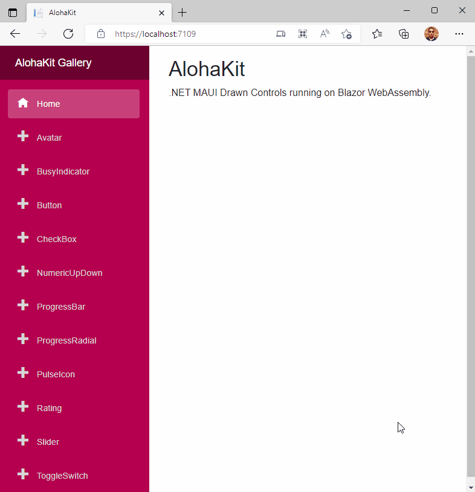

# AlohaKit Blazor Prototype

Prototype and test to bring drawn controls from .NET MAUI to Blazor WebAssembly.

_NOTE: [AlohaKit](https://github.com/jsuarezruiz/AlohaKit) is a set of .NET MAUI drawn controls._

## Copyright and license

Code released under the [MIT license](https://opensource.org/licenses/MIT).